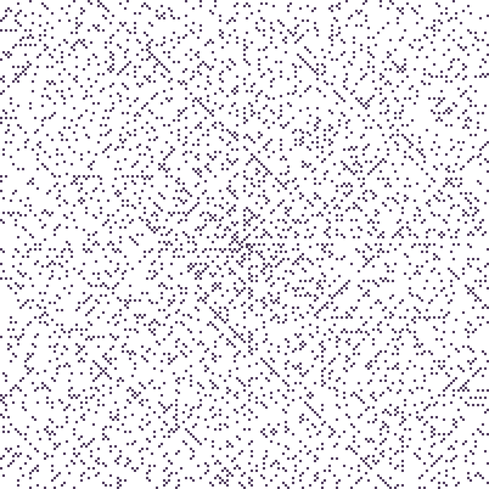

# Ulam spiral

This is a simple CLI app written in Python to generate Ulam spiral.

You can read more about Ulam spiral [here](https://en.wikipedia.org/wiki/Ulam_spiral).

---

Usage:

`python spiral.py [-h] -n <int> [-o <str>] [-s <int>] [-e <str>] [-d] [-p PRIMES_COLOR] [-c COMPOSITES_COLOR] [-a] [-t <int>] [-w WALKER_COLOR]`

options:

-  -h, --help           show this help message and exit
-  -n <int>             size of the side of the spiral, total number of integers inside spiral is n x n
-  -o <str>             name of the image file in which the result will be stored
-  -s <int>             size in pixels of square representing each integer
-  -e <str>             chose extension for this file
-  -d                   when set, display effect in default image viewer
-  -p PRIMES_COLOR      color of primes in spiral, can be an english word or html hex code
-  -c COMPOSITES_COLOR  color of composite numbers in spiral, can be an english word or html hex code
-  -a                   when set program will generate GIF animation instead of single image
-  -t <int>             duration of animation in ms, only relevant if animation flag is set
-  -w WALKER_COLOR      color of spiral walker, can be an english word or html hex code, only relevant if animation flag is set

Example:

`python spiral.py -n 101 -o 'example' -s 6 -d -p 'black' -c '#ffffff'`

